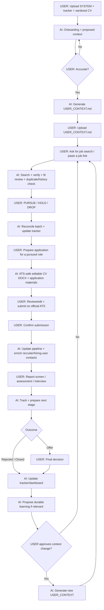

# AI Job Search OS

**A human-in-the-loop AI job-search workflow for discovering, evaluating, preparing, tracking, and managing opportunities while keeping consequential decisions with the user.**

[Versi Bahasa Indonesia](README_ID.md)

## What it does

AI Job Search OS turns an AI Project/workspace into a structured job-search partner. It can:

- discover jobs and review fit against approved career context;
- process job links you find yourself;
- verify stale LinkedIn/job-board results against official employer career pages;
- maintain job tracking and decision history;
- distinguish user **Dropped** decisions from employer **Rejections**;
- prepare ATS-safe CVs, cover letters, and application answers from verified evidence;
- research recruiters / likely hiring users after you choose to pursue/apply;
- support outreach, interview/assessment preparation, and pipeline analysis;
- preserve durable career context only after user review and approval.

The user always owns **PURSUE / HOLD / DROP, submission, outreach, and offer decisions**.

## Quick start

1. Download [`SYSTEM.md`](starter/SYSTEM.md) and [`JOB_TRACKER.xlsx`](starter/JOB_TRACKER.xlsx).
2. Create a new AI Project/workspace.
3. Upload both files plus a **sanitized copy of your latest CV**.
4. Start chatting normally.
5. The AI runs onboarding and shows its proposed understanding.
6. Correct it until accurate, then approve it.
7. The AI generates `USER_CONTEXT.md`.
8. Add `USER_CONTEXT.md` back to the same Project Sources.

The Project is now in **ACTIVE MODE**.

## End-to-end workflow



## The AI should operate as a workflow, not a looping chatbot

Human-in-the-loop does **not** mean asking the user for permission at every micro-step.

When the SOP already determines the next low-risk/reversible step, the AI should execute it. It should not repeatedly ask:

```text
Do you want it ATS-friendly?
PDF or DOCX?
Should I update the tracker?
Should I search for recruiters too?
Would you like me to continue?
```

The AI asks only when the missing answer genuinely blocks factual correctness, eligibility, privacy, a consequential decision, or an external action.

## Default application documents

When you say `Prepare my application for JOB-012`, the defaults are already defined:

- **CV = editable DOCX**, not PDF;
- ATS-safe, single-column layout;
- no photos, icons, sidebars, skill bars, infographics, floating text boxes, or multi-column layouts;
- conventional section headings;
- default **1 page for early/mid-career profiles** when relevant evidence can fit without distortion;
- 2 pages only when experience/seniority genuinely justifies it;
- JD terms are used only when supported by verified evidence;
- page pressure never justifies invented metrics/outcomes or stronger claims;
- cover letters are also editable DOCX when required/requested;
- PDF is produced only when the user asks for it or the employer requires it.

If the platform cannot create DOCX, it must state the limitation and provide an editable fallback — **never silently substitute PDF**.

## Example commands

```text
Find 20 jobs that fit me.
Review this job: [link].
Pursue A, C, and F. Drop the rest.
Prepare my application for JOB-012.
I submitted JOB-012.
Prepare me for the recruiter screen.
Show my job-search dashboard.
```

## Job freshness

AI search, LinkedIn, and job boards are not guaranteed to be complete or current.

For important opportunities, the system should cross-check the employer's **official careers page**. If the original posting is stale/closed, it should look for the exact role or a live alternative at the same employer and label alternatives clearly.

## Human shortlist & recruiter enrichment

The AI can search broadly, but it should not deep-research recruiters for every search result.

Default flow:

`Discovery → Human shortlist → PURSUE/APPLY → deep recruiter/hiring-user enrichment`

The user can explicitly request earlier contact research.

## Privacy

Use a sanitized CV copy. Remove unnecessary identifiers such as phone number, personal email, full home address, DOB, national ID/passport/tax numbers, or signatures.

Never store passwords, OTPs, banking information, or employer-portal credentials in the Project. Enter sensitive information directly on the employer's official ATS.

## File safety

This repository requires no executable, installer, browser extension, API key, OAuth connection, plugin, background process, or telemetry.

`SYSTEM.md` is plain text. `JOB_TRACKER.xlsx` is a macro-free `.xlsx` workbook for tracking/reporting.

## Architecture

```text
SYSTEM.md
    = HOW the AI should operate

USER_CONTEXT.md
    = WHO + WHY — user-approved durable career context

JOB_TRACKER.xlsx
    = WHAT / NOW — jobs, contacts, activity, dashboard

Sanitized CV
    = supporting factual evidence
```

## File persistence

AI platform capabilities differ. If the platform can genuinely modify Project files, it may update the tracker directly. If not, it must not claim that a file was updated; it should preserve the latest working state and generate a replacement file when persistence is needed.

## License

Released under the [MIT License](LICENSE).

## Core principle

> AI should expand a person's ability to search, remember, compare, analyze, and execute repetitive work — not take over human judgment.
