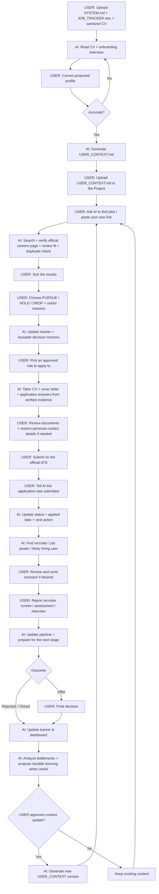

# AI Job Search OS

**A human-in-the-loop AI job-search workflow that helps you discover, evaluate, track, and manage opportunities while keeping human judgment in control.**

[Versi Bahasa Indonesia](README_ID.md)

## What it does

AI Job Search OS turns an AI Project/workspace into a structured job-search partner. It can:

- discover jobs and review fit against your approved career context;
- accept job links you find yourself;
- verify stale LinkedIn/job-board results against official company career pages;
- look for relevant live alternatives when the original posting is gone;
- maintain a structured job tracker;
- enrich recruiter and likely hiring-user contacts;
- distinguish **Dropped** decisions from employer **Rejections**;
- help with CV tailoring, cover letters, application answers, outreach, interview preparation, and pipeline analysis;
- preserve durable career context only after user review and approval.

The user always owns the final **APPLY / DROP / HOLD** decision.

## Quick start

1. Download the [Starter Pack](release/AI-Job-Search-OS-Starter-v1.5.zip).
2. Create a new AI Project/workspace.
3. Upload:
   - `SYSTEM.md`
   - `JOB_TRACKER.xlsx`
   - a **sanitized copy of your latest CV**
4. Start chatting normally.
5. The AI will run onboarding, summarize its understanding, and ask you to correct it.
6. After you approve the profile, the AI generates `USER_CONTEXT.md`.
7. Add `USER_CONTEXT.md` back to the same Project Sources.

Your project is now initialized.

## End-to-end workflow

The core idea is simple: **AI handles repetitive work and first-pass analysis; the human remains the decision-maker and the person who submits applications.**



### In plain language

**1. Set up once.** Upload the starter files and a sanitized CV. The AI interviews you but must not assume your CV automatically defines what you want next.

**2. Approve the context.** Once the AI's interpretation is accurate, it generates `USER_CONTEXT.md`. Add that file back to the Project.

**3. Ask the AI to search.** The AI performs broad discovery, verification, fit review, and can also process links you found yourself.

**4. You shortlist.** Tell the AI which roles to pursue, hold, or drop. A location-based drop should not become a company-wide blacklist.

**5. Prepare each approved application.** Ask the AI for a role-specific CV, cover letter, and application answers grounded in verified evidence. You still review the output.

**6. You submit.** Enter sensitive information yourself on the employer's official ATS. After submitting, tell the AI so it can update the tracker.

**7. AI helps with follow-through.** It can find recruiters/hiring users, support outreach, assessments, and interviews, and keep the pipeline current based on your updates.

**8. Outcomes become feedback.** Offers, rejections, closed postings, and preference changes are reflected in tracking/context with the appropriate human approval. Then the loop returns to job search.

## Five commands are enough

```text
Find jobs for me.
Review this job: [link].
I want to pursue A, C, and F. Drop the rest.
Prepare my CV + cover letter for JOB-012.
Show my job-search dashboard.
```

You may also simply paste a job URL. A viable user-supplied link should automatically go through verification, fit review, tracking, and contact enrichment.

## Job freshness

AI search, LinkedIn, and job boards are not guaranteed to be complete or current.

For important opportunities, verify the role on the employer's **official careers page** before applying.

If a supplied link is stale or closed, the system is instructed to look for:
1. the same role on the official careers site; or
2. relevant live alternatives at the same employer.

It must not silently present a stale role as live.

## Privacy

Use a sanitized CV copy. Remove unnecessary personal identifiers before upload, such as:

- phone number;
- personal email;
- full home address;
- date of birth;
- national ID / passport / tax numbers;
- signatures.

Never store passwords, OTPs, banking information, or employer-portal credentials in the project.

Enter sensitive information directly on the employer's official application site.

## File safety

This repository does **not** require:

- executables or installers;
- browser extensions;
- API keys;
- OAuth;
- plugins;
- background processes;
- telemetry.

`SYSTEM.md` is plain text.

`JOB_TRACKER.xlsx` is a standard macro-free `.xlsx` workbook containing structured tables, formulas, dropdowns, and formatting for tracking/reporting.

No executable code is required to use the workflow.

You are encouraged to inspect the files before use. SHA-256 checksums are included in [`SHA256SUMS.txt`](SHA256SUMS.txt).

## Architecture

```text
SYSTEM.md
    = HOW the AI should operate

USER_CONTEXT.md
    = WHO the user is + WHY durable career decisions exist
      (generated only after onboarding + user approval)

JOB_TRACKER.xlsx
    = WHAT is happening NOW
      (jobs, contacts, activity, dashboard)

Sanitized CV
    = supporting factual evidence
```

## Human-in-the-loop memory

The AI should not infer your future direction only from your past CV.

On first use it interviews you, shows its proposed understanding, and waits for your approval before generating persistent `USER_CONTEXT.md`.

When durable preferences later change, it should propose a context update, ask for approval, then generate a replacement `USER_CONTEXT.md`.

## Try it without committing to setup

If your AI can browse public GitHub pages/repositories, you can give it the repository URL and ask:

```text
Read SYSTEM.md from this repository and explain how this AI Job Search OS works.
```

That is useful for inspection or a quick trial.

For reliable ongoing use and personal tracking, add the starter files directly to a persistent Project/workspace.

## Repository structure

```text
.
├── README.md
├── README_ID.md
├── LICENSE
├── SECURITY.md
├── CHANGELOG.md
├── SHA256SUMS.txt
├── starter/
│   ├── SYSTEM.md
│   └── JOB_TRACKER.xlsx
├── release/
│   └── AI-Job-Search-OS-Starter-v1.5.zip
└── docs/
    ├── index.html
    ├── style.css
    ├── PANDUAN_ID.md
    └── downloads/
```

## License

Released under the [MIT License](LICENSE).

## Core principle

> AI should expand a person's ability to search, remember, compare, and analyze — not replace human judgment.
