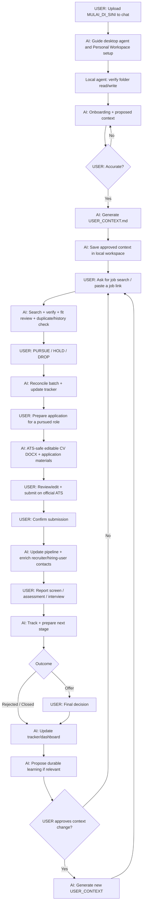

# AI Job Search OS

**A human-in-the-loop AI job-search workflow for discovering, evaluating, preparing, tracking, and managing opportunities while keeping consequential decisions with the user.**

[Versi Bahasa Indonesia](README_ID.md)

## What it does

AI Job Search OS turns a user-owned local folder into a structured workspace for a local AI agent. It can:

- discover jobs and review fit against approved career context;
- process job links you find yourself;
- verify stale LinkedIn/job-board results against official employer career pages;
- maintain job tracking and decision history;
- distinguish user **Dropped** decisions from employer **Rejections**;
- prepare ATS-safe CVs, cover letters, and application answers from verified evidence;
- research recruiters / likely hiring users after you choose to pursue/apply;
- support outreach, interview/assessment preparation, and pipeline analysis;
- preserve durable career context only after user review and approval.

The user always owns **PURSUE / HOLD / DROP, submission, outreach, and offer decisions**.

## Quick start

**Next release: v1.7.0 (in development).** It adds an interactive local dashboard. The current published stable release remains v1.6.0; see [validation](VALIDATION.md).

1. Download [`MULAI_DI_SINI.md`](starter/MULAI_DI_SINI.md).
2. Upload it to the AI chat you already use and say **Help me get started**. You do not need to find another file yourself.
3. The AI collects the minimum choices, supplies the correct official app and Personal Workspace ZIP links, and explains the whole setup in clear stages.
4. Download and extract the Personal Workspace ZIP from the exact-version link supplied by the AI.
5. Open that folder in Codex, Claude Code, Antigravity IDE, Cursor, or another compatible local agent.
6. The agent verifies folder write access and one tracker mode before onboarding. Context and application outputs remain in that folder.
7. In local mode, open `BUKA_DASHBOARD.html`; in Google mode, open your verified Sheet.

Users do not need a GitHub account, clone, branch, or command line. The Personal Workspace contains no `.git` metadata and prohibits pushing or publishing personal data. Portable chat mode remains a limited-persistence fallback.

## End-to-end workflow



## The AI should operate as a workflow, not a looping chatbot

Human-in-the-loop does **not** mean asking the user for permission at every micro-step.

When the SOP already determines the next low-risk/reversible step, the AI should execute it. It should not repeatedly ask:

```text
Do you want it ATS-friendly?
PDF or DOCX?
Should I update the tracker?
Should I search for recruiters too?
Would you like me to continue?
```

The AI asks only when the missing answer genuinely blocks factual correctness, eligibility, privacy, a consequential decision, or an external action.

## Default application documents

When you say `Prepare my application for JOB-012`, the defaults are already defined:

- **CV = editable DOCX**, not PDF;
- ATS-safe, single-column layout;
- no photos, icons, sidebars, skill bars, infographics, floating text boxes, or multi-column layouts;
- conventional section headings;
- default **1 page for early/mid-career profiles** when relevant evidence can fit without distortion;
- 2 pages only when experience/seniority genuinely justifies it;
- JD terms are used only when supported by verified evidence;
- page pressure never justifies invented metrics/outcomes or stronger claims;
- cover letters are also editable DOCX when required/requested;
- PDF is produced only when the user asks for it or the employer requires it.

If the platform cannot create DOCX, it must state the limitation and provide an editable fallback — **never silently substitute PDF**.

## Example commands

```text
Find 20 jobs that fit me.
Review this job: [link].
Pursue A, C, and F. Drop the rest.
Prepare my application for JOB-012.
I submitted JOB-012.
Prepare me for the recruiter screen.
Show my job-search dashboard.
```

## Job freshness

AI search, LinkedIn, and job boards are not guaranteed to be complete or current.

For important opportunities, the system should cross-check the employer's **official careers page**. If the original posting is stale/closed, it should look for the exact role or a live alternative at the same employer and label alternatives clearly.

## Human shortlist & recruiter enrichment

The AI can search broadly, but it should not deep-research recruiters for every search result.

Default flow:

`Discovery → Human shortlist → PURSUE/APPLY → deep recruiter/hiring-user enrichment`

The user can explicitly request earlier contact research.

## Privacy

Use a sanitized CV copy. Remove unnecessary identifiers such as phone number, personal email, full home address, DOB, national ID/passport/tax numbers, or signatures.

Never store passwords, OTPs, banking information, or employer-portal credentials in the workspace. Enter sensitive information directly on the employer's official ATS.

## File safety

The Personal Workspace contains instructions, the workflow, and empty JSON state. It contains no Git metadata, executable, API key, or telemetry. CVs, context, and application files remain in the user-selected folder unless the user moves or shares them. Tracker state also stays local by default; only users who choose Google Sheets store it in their own Google Drive.

## Architecture

```text
MULAI_DI_SINI.md
    = GUIDE — move from web chat to a local agent

Personal Workspace / system/ai-job-search-os
    = HOW the AI should operate

profile/USER_CONTEXT.md
    = WHO + WHY — user-approved durable career context

data/tracker.config.json
    = TRACKER CHOICE — local JSON or Google Sheets

data/tracker.json or a verified Google Sheet
    = WHAT / NOW — jobs, contacts, activity

Sanitized CV
    = supporting factual evidence
```

## File persistence

During setup, the user chooses a local tracker or Google Sheets. Local mode needs no Google account and uses `data/tracker.json` plus the HTML dashboard. Google mode begins only after the user authorizes through Google's official UI and the agent proves read/write access to the user-owned Sheet. One workspace always has one canonical tracker; the two stores are never silently dual-written. A chat-only fallback must never claim unverified persistence.

## License

Released under the [MIT License](LICENSE).

## Core principle

> AI should expand a person's ability to search, remember, compare, analyze, and execute repetitive work — not take over human judgment.
