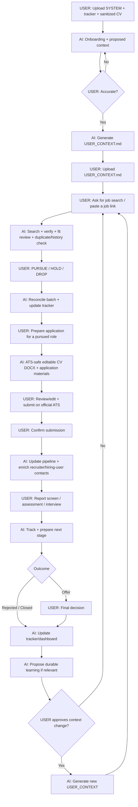

# AI Job Search OS

**Workflow job search berbasis human-in-the-loop AI untuk membantu kamu mencari, menilai, menyiapkan aplikasi, melacak, dan mengelola lowongan tanpa menyerahkan keputusan akhir ke AI.**

[English version](README.md)

## Sistem ini bisa apa?

AI Job Search OS mengubah AI Project/workspace menjadi partner job search yang lebih terstruktur. AI dapat:

- mencari lowongan dan menilai fit berdasarkan konteks karier yang sudah kamu approve;
- menerima link lowongan yang kamu temukan sendiri;
- cross-check hasil LinkedIn/job board yang stale ke career page resmi perusahaan;
- menjaga job tracker dan history keputusan;
- membedakan **Dropped** oleh user dengan **Rejected** oleh perusahaan;
- menyiapkan CV ATS-safe, cover letter, dan application answers dari verified evidence;
- mencari recruiter / probable hiring user setelah kamu memilih untuk pursue/apply;
- membantu outreach, interview/assessment prep, dan pipeline analysis;
- menyimpan konteks karier durable hanya setelah kamu review dan approve.

Keputusan akhir **PURSUE / HOLD / DROP, submission, outreach, dan offer tetap milik kamu**.

## Cara mulai

1. Download [`SYSTEM.md`](starter/SYSTEM.md) dan [`JOB_TRACKER.xlsx`](starter/JOB_TRACKER.xlsx).
2. Buat AI Project/workspace baru.
3. Upload kedua file tadi + **salinan CV terbaru yang sudah disanitasi**.
4. Mulai ngobrol seperti biasa.
5. AI melakukan onboarding dan menampilkan pemahamannya.
6. Koreksi sampai akurat, lalu approve.
7. AI membuat `USER_CONTEXT.md`.
8. Upload `USER_CONTEXT.md` kembali ke Project Sources yang sama.

Selesai. Project sudah masuk **ACTIVE MODE**.

## End-to-end workflow



## AI harus jalan seperti workflow, bukan chatbot yang muter-muter

Human-in-the-loop **bukan** berarti AI harus minta izin untuk setiap micro-step.

Kalau SOP sudah menentukan langkah berikutnya dan langkah itu low-risk/reversible, AI harus langsung menjalankannya. AI tidak seharusnya terus bertanya:

```text
Mau saya bikin ATS-friendly?
Mau PDF atau DOCX?
Mau saya update tracker?
Mau saya cari recruiternya juga?
Mau saya lanjut?
```

AI hanya bertanya kalau jawabannya benar-benar blocking untuk factual correctness, eligibility, privacy, consequential decision, atau external action.

## Default dokumen aplikasi

Kalau kamu bilang `Siapkan application untuk JOB-012`, default-nya sudah ditentukan:

- **CV = editable DOCX**, bukan PDF;
- ATS-safe dan single-column;
- tanpa photo, icon, sidebar, skill bar, infographic, floating text box, atau layout multi-column;
- section heading konvensional;
- default **1 halaman untuk early/mid-career** bila evidence relevan bisa direpresentasikan tanpa distorsi;
- 2 halaman hanya bila experience/seniority memang membutuhkannya;
- keyword dari JD hanya digunakan kalau didukung verified evidence;
- page limit tidak pernah menjadi alasan untuk mengarang metrics/outcome atau memperkuat claim;
- cover letter juga default editable DOCX bila diperlukan/requested;
- PDF hanya dibuat kalau user meminta atau employer memang mewajibkan.

Kalau platform tidak bisa membuat DOCX, AI harus menyatakan limitation tersebut dan memberikan fallback editable — **bukan diam-diam mengganti output menjadi PDF**.

## Contoh perintah

```text
Cari 20 lowongan yang cocok buat gue.
Review lowongan ini: [link].
A, C, dan F gue pursue. Sisanya drop.
Siapin application buat JOB-012.
Gue sudah submit JOB-012.
Prepare gue buat recruiter screen.
Tampilkan dashboard tracker gue.
```

## Freshness lowongan

Hasil AI search, LinkedIn, dan job board **tidak selalu lengkap atau up to date**.

Untuk opportunity penting, sistem harus cross-check ke **career page resmi perusahaan**. Kalau posting awal stale/closed, AI mencari exact role atau live alternative di perusahaan yang sama dan memberi label alternatif dengan jelas. AI tidak boleh berpura-pura posting lama masih aktif.

## Human shortlist & recruiter enrichment

AI boleh search secara luas, tapi tidak perlu melakukan deep recruiter research untuk semua search noise.

Flow default:

`Discovery → Human shortlist → PURSUE/APPLY → deep recruiter/hiring-user enrichment`

Kalau kamu memang minta contact research lebih awal, AI boleh melakukannya.

## Privacy

Gunakan salinan CV yang sudah disanitasi. Hapus data pribadi yang tidak dibutuhkan, misalnya nomor telepon, email pribadi, alamat lengkap, DOB, NIK/paspor/NPWP, atau tanda tangan.

Jangan simpan password, OTP, bank information, atau employer-portal credentials di Project. Isi data sensitif langsung di official ATS perusahaan.

## Keamanan file

Repository ini tidak membutuhkan executable, installer, browser extension, API key, OAuth, plugin, background process, atau telemetry.

`SYSTEM.md` adalah plain text. `JOB_TRACKER.xlsx` adalah workbook `.xlsx` macro-free untuk tracking/reporting.

## Arsitektur

```text
SYSTEM.md
    = HOW — bagaimana AI harus bekerja

USER_CONTEXT.md
    = WHO + WHY — konteks karier durable yang sudah di-approve user

JOB_TRACKER.xlsx
    = WHAT / NOW — jobs, contacts, activity, dashboard

Sanitized CV
    = supporting factual evidence
```

## File persistence

Kemampuan AI platform berbeda. Kalau platform bisa benar-benar mengubah Project file, AI boleh update tracker langsung. Kalau tidak, AI tidak boleh mengaku sudah mengubah file; ia harus memakai working state terbaru dan menghasilkan replacement file bila persistence dibutuhkan.

## Lisensi

Dirilis menggunakan [MIT License](LICENSE).

## Prinsip utama

> AI seharusnya memperbesar kemampuan manusia untuk mencari, mengingat, membandingkan, menganalisis, dan mengeksekusi pekerjaan repetitif — bukan mengambil alih human judgment.
