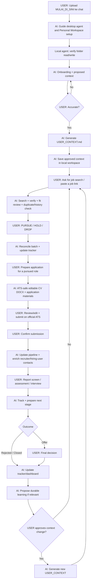

# AI Job Search OS

**Workflow job search berbasis human-in-the-loop AI untuk membantu kamu mencari, menilai, menyiapkan aplikasi, melacak, dan mengelola lowongan tanpa menyerahkan keputusan akhir ke AI.**

[English version](README.md)

## Sistem ini bisa apa?

AI Job Search OS mengubah folder lokal menjadi workspace yang bisa dikerjakan AI agent dan tetap dimiliki pengguna. AI dapat:

- mencari lowongan dan menilai fit berdasarkan konteks karier yang sudah kamu approve;
- menerima link lowongan yang kamu temukan sendiri;
- cross-check hasil LinkedIn/job board yang stale ke career page resmi perusahaan;
- menjaga job tracker dan history keputusan;
- membedakan **Dropped** oleh user dengan **Rejected** oleh perusahaan;
- menyiapkan CV ATS-safe, cover letter, dan application answers dari verified evidence;
- mencari recruiter / probable hiring user setelah kamu memilih untuk pursue/apply;
- membantu outreach, interview/assessment prep, dan pipeline analysis;
- menyimpan konteks karier durable hanya setelah kamu review dan approve.

Keputusan akhir **PURSUE / HOLD / DROP, submission, outreach, dan offer tetap milik kamu**.

## Cara mulai

**Rilis berikutnya: v1.7.0 (sedang dikembangkan).** Versi ini menambahkan dashboard lokal interaktif. Rilis stabil publik saat ini tetap v1.6.0; lihat [hasil validasi](VALIDATION.md).

1. Download [`MULAI_DI_SINI.md`](starter/MULAI_DI_SINI.md).
2. Upload file itu ke AI chat yang sekarang kamu pakai dan bilang **Bantu saya mulai**.
3. AI menjelaskan cara memasang aplikasi desktop resmi, memakai akun pribadi, dan membuka folder lokal tanpa istilah teknis.
4. Download dan ekstrak [Personal Workspace ZIP](release/AI-Job-Search-Personal-Workspace-v1.7.0.zip).
5. Buka folder tersebut melalui Codex, Claude Code, Antigravity IDE, Cursor, atau agent lokal yang kompatibel.
6. Agent memverifikasi baca-tulis lokal sebelum onboarding. Context, tracker, dan output selanjutnya disimpan di folder itu.
7. Buka `BUKA_DASHBOARD.html` di Chrome atau Edge untuk melihat perubahan langsung dan mengubah status lowongan.

Pengguna tidak perlu akun GitHub, `git clone`, branch, atau command line. Paket Personal Workspace tidak mengandung `.git` dan melarang push/publish data pribadi. Portable chat mode tetap tersedia sebagai fallback dengan persistence terbatas.

## End-to-end workflow



## AI harus jalan seperti workflow, bukan chatbot yang muter-muter

Human-in-the-loop **bukan** berarti AI harus minta izin untuk setiap micro-step.

Kalau SOP sudah menentukan langkah berikutnya dan langkah itu low-risk/reversible, AI harus langsung menjalankannya. AI tidak seharusnya terus bertanya:

```text
Mau saya bikin ATS-friendly?
Mau PDF atau DOCX?
Mau saya update tracker?
Mau saya cari recruiternya juga?
Mau saya lanjut?
```

AI hanya bertanya kalau jawabannya benar-benar blocking untuk factual correctness, eligibility, privacy, consequential decision, atau external action.

## Default dokumen aplikasi

Kalau kamu bilang `Siapkan application untuk JOB-012`, default-nya sudah ditentukan:

- **CV = editable DOCX**, bukan PDF;
- ATS-safe dan single-column;
- tanpa photo, icon, sidebar, skill bar, infographic, floating text box, atau layout multi-column;
- section heading konvensional;
- default **1 halaman untuk early/mid-career** bila evidence relevan bisa direpresentasikan tanpa distorsi;
- 2 halaman hanya bila experience/seniority memang membutuhkannya;
- keyword dari JD hanya digunakan kalau didukung verified evidence;
- page limit tidak pernah menjadi alasan untuk mengarang metrics/outcome atau memperkuat claim;
- cover letter juga default editable DOCX bila diperlukan/requested;
- PDF hanya dibuat kalau user meminta atau employer memang mewajibkan.

Kalau platform tidak bisa membuat DOCX, AI harus menyatakan limitation tersebut dan memberikan fallback editable — **bukan diam-diam mengganti output menjadi PDF**.

## Contoh perintah

```text
Cari 20 lowongan yang cocok buat gue.
Review lowongan ini: [link].
A, C, dan F gue pursue. Sisanya drop.
Siapin application buat JOB-012.
Gue sudah submit JOB-012.
Prepare gue buat recruiter screen.
Tampilkan dashboard tracker gue.
```

## Freshness lowongan

Hasil AI search, LinkedIn, dan job board **tidak selalu lengkap atau up to date**.

Untuk opportunity penting, sistem harus cross-check ke **career page resmi perusahaan**. Kalau posting awal stale/closed, AI mencari exact role atau live alternative di perusahaan yang sama dan memberi label alternatif dengan jelas. AI tidak boleh berpura-pura posting lama masih aktif.

## Human shortlist & recruiter enrichment

AI boleh search secara luas, tapi tidak perlu melakukan deep recruiter research untuk semua search noise.

Flow default:

`Discovery → Human shortlist → PURSUE/APPLY → deep recruiter/hiring-user enrichment`

Kalau kamu memang minta contact research lebih awal, AI boleh melakukannya.

## Privacy

Gunakan salinan CV yang sudah disanitasi. Hapus data pribadi yang tidak dibutuhkan, misalnya nomor telepon, email pribadi, alamat lengkap, DOB, NIK/paspor/NPWP, atau tanda tangan.

Jangan simpan password, OTP, bank information, atau employer-portal credentials di workspace. Isi data sensitif langsung di official ATS perusahaan.

## Keamanan file

Personal Workspace berisi instruksi, workflow, dan state JSON kosong. Paket tidak memiliki Git metadata, executable, API key, atau telemetry. CV, context, tracker, dan application files tetap berada di folder yang dipilih pengguna kecuali pengguna sendiri memindahkan atau membagikannya.

## Arsitektur

```text
MULAI_DI_SINI.md
    = GUIDE — mengantar user dari AI chat ke agent lokal

Personal Workspace / system/ai-job-search-os
    = HOW — bagaimana AI harus bekerja

profile/USER_CONTEXT.md
    = WHO + WHY — konteks karier durable yang sudah di-approve user

data/tracker.json
    = WHAT / NOW — jobs, contacts, activity

Sanitized CV
    = supporting factual evidence
```

## File persistence

Agent lokal membaca dan memperbarui `data/tracker.json`, memverifikasi hasil tulis, lalu menyegarkan `reports/DASHBOARD.md`. Chat-only fallback tidak boleh mengaku memiliki persistence lokal.

## Lisensi

Dirilis menggunakan [MIT License](LICENSE).

## Prinsip utama

> AI seharusnya memperbesar kemampuan manusia untuk mencari, mengingat, membandingkan, menganalisis, dan mengeksekusi pekerjaan repetitif — bukan mengambil alih human judgment.
