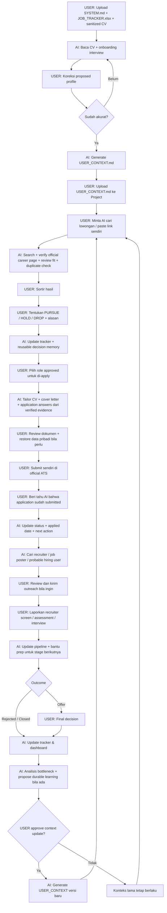

# AI Job Search OS

**Workflow job search berbasis human-in-the-loop AI untuk membantu kamu mencari, menilai, melacak, dan mengelola lowongan tanpa menyerahkan keputusan akhir ke AI.**

[English version](README.md)

## Sistem ini bisa apa?

AI Job Search OS mengubah AI Project/workspace menjadi partner job search yang lebih terstruktur.

AI dapat:

- mencari lowongan dan menilai fit berdasarkan konteks karier yang sudah kamu approve;
- menerima link lowongan yang kamu temukan sendiri;
- cross-check hasil LinkedIn/job board yang stale ke career page resmi perusahaan;
- mencari role alternatif yang masih live kalau posting awal sudah hilang;
- menjaga job tracker;
- mencari recruiter dan probable hiring user yang relevan;
- membedakan **Dropped** oleh user dengan **Rejected** oleh perusahaan;
- membantu CV, cover letter, application answer, outreach, interview prep, dan pipeline analysis;
- menyimpan konteks karier durable hanya setelah kamu review dan approve.

Keputusan akhir **APPLY / DROP / HOLD tetap milik kamu**.

## Cara mulai

1. Download [Starter Pack](release/AI-Job-Search-OS-Starter-v1.5.zip).
2. Buat AI Project/workspace baru.
3. Upload:
   - `SYSTEM.md`
   - `JOB_TRACKER.xlsx`
   - **salinan CV terbaru yang sudah disanitasi**
4. Mulai ngobrol seperti biasa.
5. AI akan melakukan onboarding, merangkum pemahamannya, lalu meminta kamu mengoreksi jika ada yang salah.
6. Setelah kamu approve, AI akan membuat `USER_CONTEXT.md`.
7. Upload `USER_CONTEXT.md` kembali ke Project Sources yang sama.

Selesai. Project kamu sudah terinisialisasi.

## End-to-end workflow

Yang paling penting: **AI melakukan pekerjaan repetitif dan analisis awal; manusia tetap menjadi decision-maker dan pihak yang melakukan submission.**



### Dalam bahasa sederhana

**1. Setup sekali.** Kamu upload starter + CV yang sudah disanitasi. AI interview kamu, tapi tidak boleh menganggap isi CV otomatis sama dengan arah karier yang kamu mau.

**2. Kamu approve konteksnya.** Setelah interpretasi AI sudah benar, AI membuat `USER_CONTEXT.md`. Kamu upload file itu kembali ke Project.

**3. Minta AI cari kerja.** AI melakukan broad search, verification, fit review, dan bisa menerima link yang kamu temukan sendiri.

**4. Kamu yang sortir.** Bilang role mana yang ingin dikejar, ditahan, atau di-drop. Alasan drop digunakan dengan scope yang benar — drop karena lokasi bukan berarti blacklist perusahaan.

**5. Untuk role yang approved, minta application pack.** AI bisa menyiapkan CV, cover letter, dan application answers per role dari verified evidence. Kamu tetap review hasilnya.

**6. Kamu yang submit.** Data sensitif diisi sendiri di official ATS perusahaan. Setelah submit, beri tahu AI agar tracker diperbarui.

**7. AI bantu follow-through.** AI mencari recruiter/hiring user, membantu outreach, assessment, interview prep, dan terus memperbarui pipeline berdasarkan update yang kamu berikan.

**8. Outcome kembali menjadi feedback.** Offer, rejection, closed posting, atau perubahan preference masuk ke tracker/context dengan approval manusia yang sesuai. Lalu loop kembali ke job search berikutnya.

## Lima perintah yang cukup

```text
Cari lowongan untuk saya.
Review lowongan ini: [link].
Yang A, C, dan F saya pursue. Sisanya drop.
Siapkan CV + cover letter untuk JOB-012.
Tampilkan dashboard tracker saya.
```

Kamu juga boleh langsung paste link lowongan. Untuk role yang layak, AI seharusnya otomatis melakukan verification, fit review, tracking, dan contact enrichment.

## Freshness lowongan

Hasil AI search, LinkedIn, dan job board **tidak selalu lengkap atau up to date**.

Untuk opportunity penting, selalu cross-check di **career page resmi perusahaan** sebelum apply.

Kalau link yang kamu berikan ternyata stale atau closed, sistem diperintahkan untuk mencari:
1. role yang sama di career page resmi; atau
2. alternatif yang masih live dan relevan di perusahaan yang sama.

AI tidak boleh diam-diam menganggap posting lama masih aktif.

## Privacy

Gunakan salinan CV yang sudah disanitasi. Hapus data pribadi yang tidak dibutuhkan, misalnya:

- nomor telepon;
- email pribadi;
- alamat rumah lengkap;
- tanggal lahir;
- NIK / paspor / NPWP;
- tanda tangan.

Jangan pernah simpan password, OTP, informasi rekening, atau kredensial portal lamaran di project.

Data sensitif yang memang diperlukan perusahaan sebaiknya kamu isi langsung di situs resmi perusahaan.

## Keamanan file

Repository ini **tidak membutuhkan**:

- executable atau installer;
- browser extension;
- API key;
- OAuth;
- plugin;
- background process;
- telemetry.

`SYSTEM.md` hanyalah file teks biasa.

`JOB_TRACKER.xlsx` adalah workbook `.xlsx` macro-free berisi tabel, formula, dropdown, dan formatting untuk tracking/reporting.

Tidak ada executable code yang perlu dijalankan agar workflow ini bisa digunakan.

Kamu tetap dianjurkan memeriksa file sebelum menggunakannya. SHA-256 checksum tersedia di [`SHA256SUMS.txt`](SHA256SUMS.txt).

## Arsitektur

```text
SYSTEM.md
    = HOW — bagaimana AI harus bekerja

USER_CONTEXT.md
    = WHO + WHY — siapa user dan alasan durable di balik keputusan karier
      (baru dibuat setelah onboarding + approval user)

JOB_TRACKER.xlsx
    = WHAT / NOW — apa yang sedang terjadi
      (jobs, contacts, activity, dashboard)

Sanitized CV
    = supporting factual evidence
```

## Human-in-the-loop memory

AI tidak boleh menyimpulkan arah masa depan kamu hanya dari pekerjaan yang tertulis di CV.

Pada penggunaan pertama, AI melakukan interview, menampilkan proposed understanding, lalu menunggu approval sebelum membuat `USER_CONTEXT.md`.

Kalau preference durable berubah di masa depan, AI harus mengusulkan update, meminta approval, lalu membuat replacement `USER_CONTEXT.md`.

## Mau coba tanpa setup dulu?

Kalau AI yang kamu pakai bisa membaca public GitHub repository/page, kamu bisa kasih link repository ini lalu bilang:

```text
Baca SYSTEM.md dari repository ini dan jelaskan cara kerja AI Job Search OS ini.
```

Ini cocok untuk inspeksi atau coba cepat.

Untuk penggunaan rutin dan tracking personal yang lebih reliable, upload starter files langsung ke Project/workspace.

## Struktur repository

```text
.
├── README.md
├── README_ID.md
├── LICENSE
├── SECURITY.md
├── CHANGELOG.md
├── SHA256SUMS.txt
├── starter/
│   ├── SYSTEM.md
│   └── JOB_TRACKER.xlsx
├── release/
│   └── AI-Job-Search-OS-Starter-v1.5.zip
└── docs/
    ├── index.html
    ├── style.css
    ├── PANDUAN_ID.md
    └── downloads/
```

## Lisensi

Dirilis menggunakan [MIT License](LICENSE).

## Prinsip utama

> AI seharusnya memperbesar kemampuan manusia untuk mencari, mengingat, membandingkan, dan menganalisis — bukan menggantikan human judgment.
