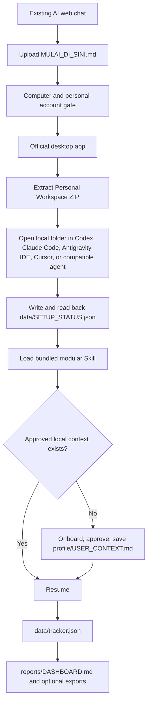

# AI Job Search OS v1.6 — chat-guided, local-workspace-first

The current AI chat is a Migration Coach. It teaches the user why a folder-capable agent is needed, checks the personal-account safety gate, and guides one visible setup action at a time. The job-search runtime begins only after a local agent opens the Personal Workspace and proves it can write and read back local state.

## Distribution artifacts

| Canonical source | Generated result |
| --- | --- |
| `MIGRATION_COACH.md` + `manifest.json` | `starter/MULAI_DI_SINI.md` and Pages download |
| `workspace/` + canonical Skill | Versioned Personal Workspace ZIP |
| `skill/ai-job-search-os/` | Workspace runtime, native Skill ZIP, and portable workflow |
| `INSTALL.md` | Compatibility `SYSTEM.md` for chat-only/native-Skill hosts |
| `scripts/build_release.py` | Reproducible artifacts and checksums |

The Personal Workspace contains no `.git`, `.github`, maintainer scripts, credentials, or personal data. Its `AGENTS.md` forbids Git initialization, remotes, pushes, publishing, and personal-data upload. Users download a release asset and never clone the maintainer repository.

## Local state

- `profile/USER_CONTEXT.md`: user-approved durable career context.
- `profile/`: sanitized CV and user evidence.
- `data/tracker.json`: canonical jobs, contacts, and activity state.
- `data/SETUP_STATUS.json`: observed local write/read verification.
- `data/backups/`: backups before nontrivial state migrations.
- `applications/<JOB_ID>/`: application artifacts.
- `reports/DASHBOARD.md`: generated human-readable view, not canonical data.

The agent must read current state before duplicate checks, preserve Job IDs/history, write valid JSON safely, read it back, and refresh the report. File existence alone does not prove persistence.

## Compatibility boundary

The friendly path requires a computer, a personal provider account, an official agent with local-folder access, and permission to that folder. Codex, Claude Code, Antigravity IDE, and Cursor have different availability and UI; the Migration Coach checks what is actually visible instead of promising plan support. Work, Cowork, cloud Projects, Sources, and chat attachments are excluded from the v1.6 runtime because they do not prove direct write-back to the local tracker.

Portable chat mode remains available when local access is impossible, but cannot promise automatic local persistence. Local storage also does not imply that model processing stays on-device; provider data handling still applies.

## Updates

Normal runtime does not fetch GitHub. A user-requested update is downloaded to a temporary folder, version/checksum verified, and applied only to system files. `profile/`, `data/`, `applications/`, and `reports/` are preserved. The Personal Workspace never becomes a Git checkout.

## Maintenance

Developers follow the repository root `AGENTS.md`; end-user agents follow the different `workspace/AGENTS.md`. Change canonical sources, bump versions for material behavior changes, rebuild, run distribution tests, and record actual host acceptance separately. Package checks never certify a named host.
